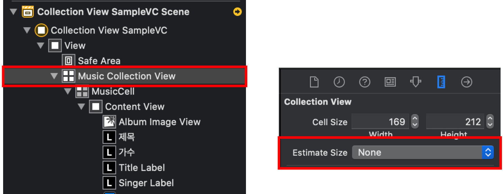
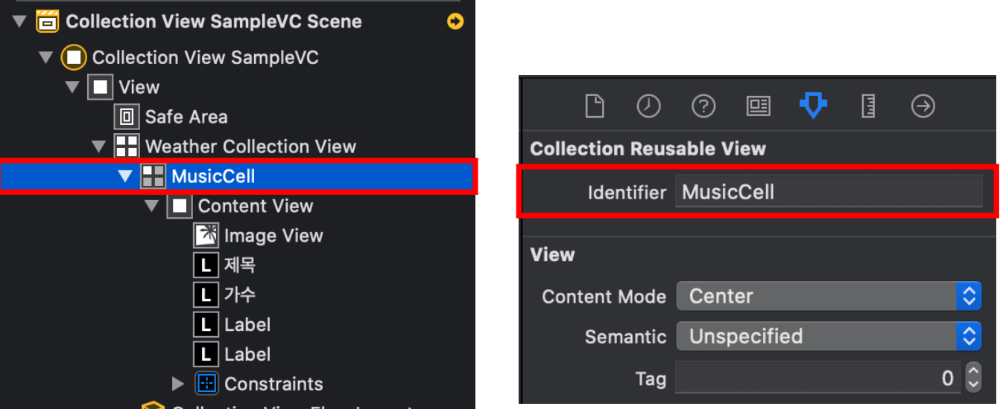
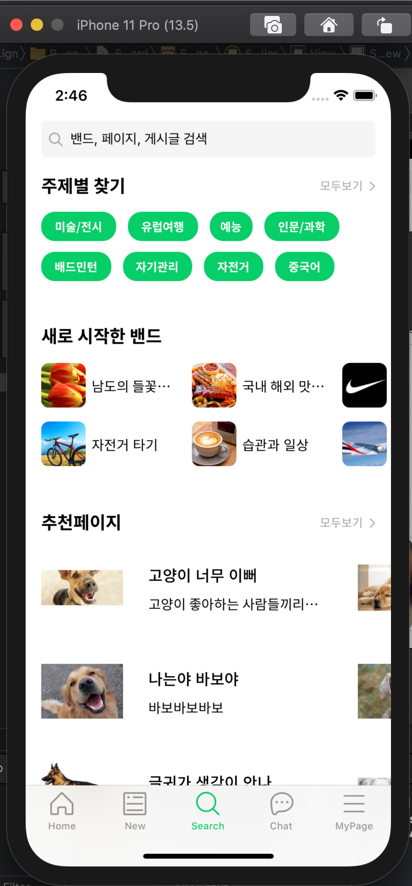

### UICollectionView 만들기

1. collection view 드래그 & 드롭 / Estimate size : None 으로 지정

   

2. Cell의 identifier을 지정해준다.
   

3. 오토레이아웃 탑,리드, 트레일링, 바텀을 모두 0으로 지정
4. Control + drag로 해당 ViewController에 연결해준다.

초기 세팅 완료! 

collectionView를 활용하면 다음과 같은 뷰에서 : 새로 시작한 밴드 / 추천페이지 영역을 구현할 수 있다. 라벨을 없애고 이미지로만 화면을 구성한다면 이미지 Carousel 이 가능할 것으로 생각된다.

참고링크 : https://woongsios.tistory.com/4