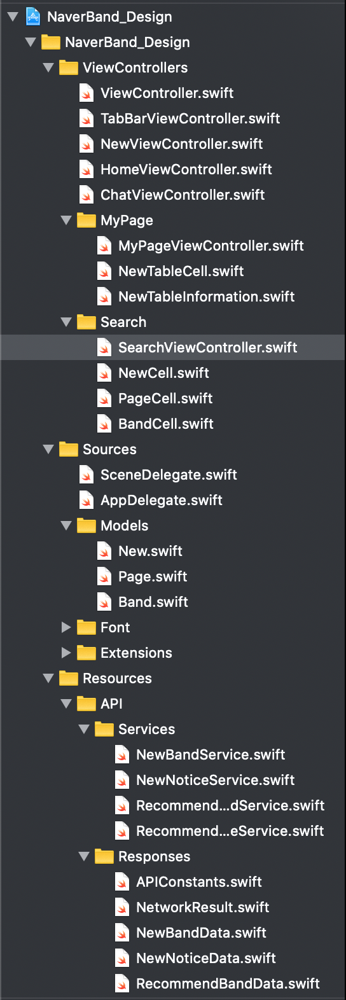
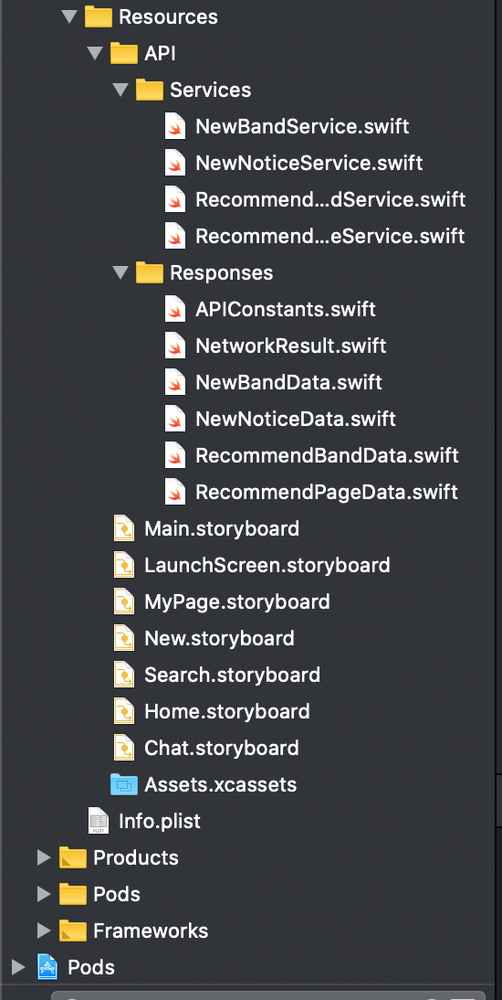

### 기본적인 폴더 정리하기

기본적인 폴더 정리는 다음과 같이 하게 될 예정입니다.

- ViewController : 뷰와 관련된 swift 파일 모음 / 안에서도 기능별로 묶을 수 있다.
- Sources: SceneDelegate, AppDelegate / Font / Model / Extensions
- Resources : API / Services/ Responses

하지만 같이 협업하게 될 iOS 파트원들의 의견이 가장 중요함!!!

### 커스텀 폰트 입히기

