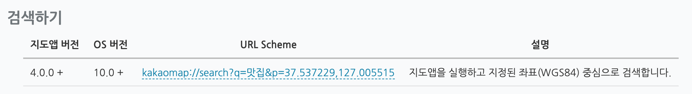

### 장소검색 API

카카오 지도 iOS API / 네이버 장소검색 API / Google Place API 중 택1 하여 진행

- 개인적으로는 카카오 지도 API가 정리가 잘 되어 있음!
- API 명세서를 보고 구현하면 어렵지 않을 것으로 생각됨!

https://apis.map.kakao.com/ios/guide/ 

search?q = “키워드” & p = 현재 사용자의 위도, 경도(자동으로 사용자가 위치정보 사용 허용을 누르면 받아옴)를 통해 장소검색

