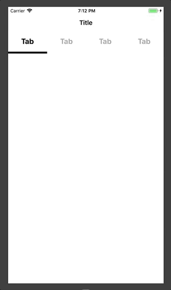

### Custom Tab bar 만들기

```swift

import UIKit

protocol CustomMenuBarDelegate: class {
    func customMenuBar(scrollTo index: Int)
}

class CustomMenuBar: UIView {
    
    weak var delegate: CustomMenuBarDelegate?
    override init(frame: CGRect) {
        super.init(frame: frame)
        self.backgroundColor = .white
        setupCustomTabBar()
    }
    
    required init?(coder aDecoder: NSCoder) {
        fatalError("init(coder:) has not been implemented")
    }
    
    var customTabBarCollectionView: UICollectionView = {
        let collectionViewLayout = UICollectionViewFlowLayout()
        collectionViewLayout.scrollDirection = .horizontal
        let collectionView = UICollectionView(frame: CGRect(x: 0, y: 0, width: 0, height: 0), collectionViewLayout: collectionViewLayout)
        collectionView.translatesAutoresizingMaskIntoConstraints = false
        collectionView.backgroundColor = .white
        return collectionView
    }()
    
    var indicatorView: UIView = {
        let view = UIView()
        view.translatesAutoresizingMaskIntoConstraints = false
        view.backgroundColor = .black
        return view
    }()
    //MARK: Properties
    var indicatorViewLeadingConstraint:NSLayoutConstraint!
    var indicatorViewWidthConstraint: NSLayoutConstraint!
    //MARK: Setup Views
    func setupCollectioView(){
        customTabBarCollectionView.delegate = self
        customTabBarCollectionView.dataSource = self
        customTabBarCollectionView.showsHorizontalScrollIndicator = false
        customTabBarCollectionView.register(UINib(nibName: CustomCell.reusableIdentifier, bundle: nil), forCellWithReuseIdentifier: CustomCell.reusableIdentifier)
        customTabBarCollectionView.isScrollEnabled = false
        
        let indexPath = IndexPath(item: 0, section: 0)
        customTabBarCollectionView.selectItem(at: indexPath, animated: false, scrollPosition: [])
    }
    
    func setupCustomTabBar(){
        setupCollectioView()
        self.addSubview(customTabBarCollectionView)
        customTabBarCollectionView.leadingAnchor.constraint(equalTo: self.leadingAnchor).isActive = true
        customTabBarCollectionView.trailingAnchor.constraint(equalTo: self.trailingAnchor).isActive = true
        customTabBarCollectionView.topAnchor.constraint(equalTo: self.topAnchor).isActive = true
        customTabBarCollectionView.heightAnchor.constraint(equalToConstant: 55).isActive = true
        
        self.addSubview(indicatorView)
        indicatorViewWidthConstraint = indicatorView.widthAnchor.constraint(equalToConstant: self.frame.width / 4)
        indicatorViewWidthConstraint.isActive = true
        indicatorView.heightAnchor.constraint(equalToConstant: 5).isActive = true
        indicatorViewLeadingConstraint = indicatorView.leadingAnchor.constraint(equalTo: self.leadingAnchor)
        indicatorViewLeadingConstraint.isActive = true
        indicatorView.bottomAnchor.constraint(equalTo: self.bottomAnchor).isActive = true
    }
    
}

//MARK:- UICollectionViewDelegate, DataSource
extension CustomMenuBar: UICollectionViewDelegate, UICollectionViewDataSource {
    
    func collectionView(_ collectionView: UICollectionView, cellForItemAt indexPath: IndexPath) -> UICollectionViewCell {
        let cell = collectionView.dequeueReusableCell(withReuseIdentifier: CustomCell.reusableIdentifier, for: indexPath) as! CustomCell
        return cell
    }
    
    func collectionView(_ collectionView: UICollectionView, numberOfItemsInSection section: Int) -> Int {
        return 4
    }
    
    func collectionView(_ collectionView: UICollectionView, layout collectionViewLayout: UICollectionViewLayout, sizeForItemAt indexPath: IndexPath) -> CGSize {
        return CGSize(width: self.frame.width / 4 , height: 55)
        
    }
    
    func collectionView(_ collectionView: UICollectionView, didSelectItemAt indexPath: IndexPath) {
        delegate?.customMenuBar(scrollTo: indexPath.row)
    }
    
    func collectionView(_ collectionView: UICollectionView, didDeselectItemAt indexPath: IndexPath) {
        guard let cell = collectionView.cellForItem(at: indexPath) as? CustomCell else {return}
        cell.label.textColor = .lightGray
    }
}
//MARK:- UICollectionViewDelegateFlowLayout
extension CustomMenuBar: UICollectionViewDelegateFlowLayout {
    
    func collectionView(_ collectionView: UICollectionView, layout collectionViewLayout: UICollectionViewLayout, insetForSectionAt section: Int) -> UIEdgeInsets {
        return UIEdgeInsets(top: 0, left: 0, bottom: 0, right: 0)
    }
    
    func collectionView(_ collectionView: UICollectionView, layout collectionViewLayout: UICollectionViewLayout, minimumLineSpacingForSectionAt section: Int) -> CGFloat {
        return 0
    }
}
```

*-didSelectItemAt didDeselectItemAt*

- `didSelectItemAt`을 통해 선택한 `CustomCell`의 `label`의 색을 바꿔줄 것이고 선택한 탭의 아래로 indicator 뷰를 움직여줄 것이기 때문에 선택한 `CustomCell` 에 따라 너비만큼 indicator 뷰의 `leadingAnchor`의 `constant` 값을 바꿔주고 이를 애니매이션으로 그려주었습니다.
- `didDeselectItemAt`을 이용한다면 1번 탭(`CustomCell`)을 선택하고 2번 탭을 선택하면 자동으로 1번 탭은 `deselect`됩니다. 그렇기 때문에 이를 활용하여 새로운 탭을 클릭했을 때 이전에 선택한 탭의 `textColor`를 원래의 상태로 바꿔주는 것을 구현했습니다.

그리고 마지막으로 처음 모든 뷰가 로드되었을 때 첫번째 탭을 선택된 탭이라고 지정하기 위해 `cellForItemAt` 메소드를 살짝 수정해주었습니다.


이렇게되면 첫 번째 탭은 뷰가 로드되었을 때 선택된 셀이라 시스템이 인지하고 `textColor`를 변경합니다. 그리고 다른 탭을 눌렀을 때는 역시 `didDeselectItemAt` 메소드에 의해 원래의 `textColor`로 바뀌게 됩니다.

실행화면



참고링크: https://github.com/protocorn93/tistory-ios/tree/master/CustomTabBar