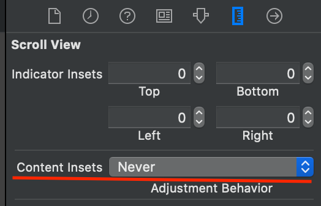
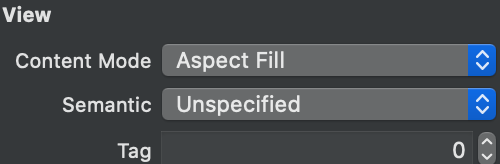
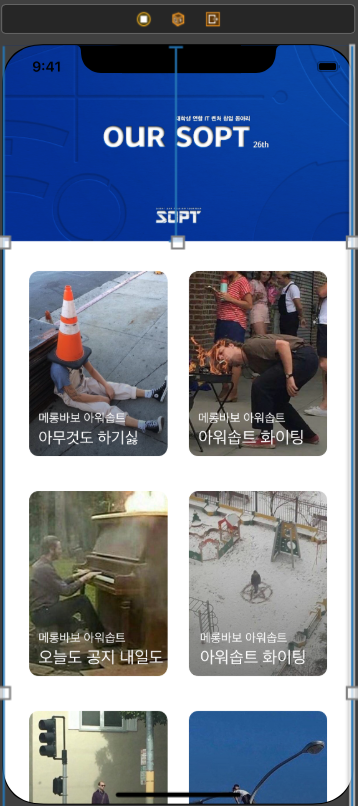
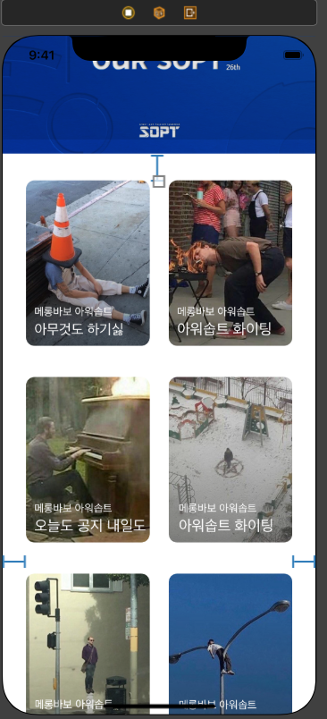
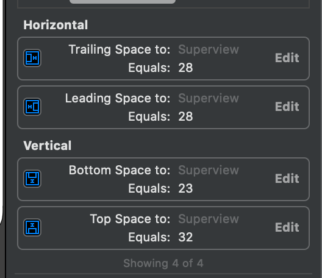

### iOS 2주차 폴더

✏️ 도전과제! ScrollView에서 Stretch Header 완성하기!

스크롤뷰에서 Stretch Header를 구현하기 위해서는 **오토레이아웃 잡는 순서가 매애애애애우 중요**하다. 대체 몇 개의 뷰 컨트롤러를 지웠다가 만들었다가 했는지...🤣

***

### 구현 화면


***

### 오토 레이아웃 잡는 순서

이번 과제를 하면서 느낀건 오토 레이아웃을 잡는 순서가 아주 중요하다는 것이다. 오토레이아웃을 잘못 잡으면 코딩을 완벽하게 해도 원하는 기능을 구현할 수 없다.

1. 먼저 세미나에서 배운대로 스크롤뷰를 만든다

그리고 이미지 뷰를 넣기 전에 스크롤 뷰 선택후 




Content Insets 를 Never로 바꾼 후에 넣어주도록 해야한다. 나중에 설정을 변경해도 노치쪽까지 이미지 뷰가 꽉 안차는것 같다(정확한지는 모르겠...)

2. 이제 이미지 뷰를 넣고 제플린에 나와있는 수치대로 설정해준다. x: 0, y:0 width:375 height:210 그리고 **가장 최상위의 뷰**와 leading. trailling, top 오토레이아웃을 잡아준다. 수치는 모두 0, 0, 0 / 그리고 이미지의 Height를 고정해준다.


❗️주의: 이미지 뷰 넣은 후에 Content Mode를 반드시 'Aspect Fill'로 변경한다❗️



3. 그 후에 이미지 뷰 바로 아래에 새로운 UI View를 넣어주고 이 뷰를 스크롤 뷰 안에 맨 처음 넣어주었던 뷰에 다 연결시켜준다. Top:210 나머지는 모두 0,0,0




4. 그 후에 스택뷰를 이미지 아래 방금 새로 만든 뷰에 넣어주고 넣어준 뷰에 32 28 28 23의 오토레이아웃을 준다.

   

   

5. 새로운 Swift 파일을 만들어서 코드로 Stretch Header 구현하기


```swift
//
//  StretchViewController.swift
//  iOS_SecondWeek_Assignment_Login
//
//  Created by 김현기 on 2020/05/07.
//  Copyright © 2020 HyunKi Kim. All rights reserved.
//

import UIKit

class StretchViewController: UIViewController {
  //image View의 Height고정한 constratint를 연결해준다. 
  @IBOutlet var imgViewHeightLayout: NSLayoutConstraint!
  //스크롤뷰를 연결해준다.
  @IBOutlet var scrollView: UIScrollView!
    
  	//이미지 뷰의 고정된 높이
    var headerImageHeight: CGFloat = 210
   	//이미지 뷰 줄어들떄 고정될 높이 
  	var minHeaderImageHeight: CGFloat = 108
    
    override func viewDidLoad() {
        super.viewDidLoad()
        
        scrollView.delegate = self
        scrollView.contentInsetAdjustmentBehavior = .never
       
    }
    
   

    
}

extension StretchViewController: UIScrollViewDelegate {
    func scrollViewDidScroll(_ scrollView: UIScrollView) {
        if scrollView.contentOffset.y < 0.0 {
            // Scrolling down: 스크롤을 아래로 내릴때
            imgViewHeightLayout.constant = headerImageHeight - scrollView.contentOffset.y
        } else {
            // Scrolling up: 스크롤을 위로 올릴때 
            var height = headerImageHeight - scrollView.contentOffset.y
            height = height > minHeaderImageHeight ? height : minHeaderImageHeight
            imgViewHeightLayout.constant = height
        }
    }
}

```


