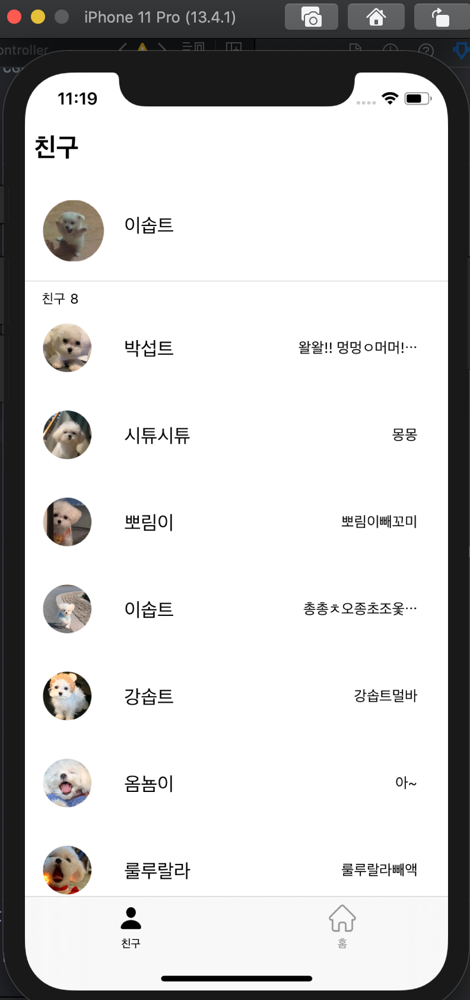
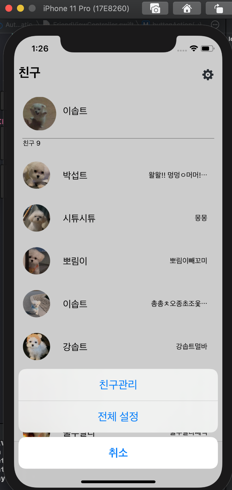
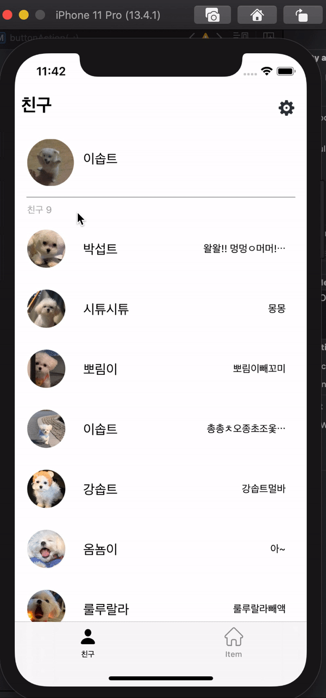

### 3주차 iOS 과제

✏️ 1. 도전과제! 탭바 컨트롤러에서 홈 또는 친구 탭 선택할 때마다 그림 바꾸기

✏️ 2. 도전과제! 테이블 뷰에서 스와이프 하여 목록 삭제하기

✏️ 3. 도전과제! actionsheet 사용해서 설정 창 만들기

✏️ 4. 도전과제의 과제! 친구 항목을 지울때마다 '친구9' 으로 표시되어 있는 친구 숫자 줄이기 

***

**과제 완성 화면**




***

### 1번 도전과제 

맨 처음에는 저걸 어떻게 하지...? 하고 눈 앞이 캄캄했지만 의외로 쉽게 설정할 수 있었다.


​	

View Controller를 탭바 컨트롤러로 바꿔준 후 탭 하는 부분을 선택하면 위와 같은 설정 화면을 볼 수 있다. 

여기에서 

* 'Selected Image': 선택되었을 때 이미지
* 'Image' : 선택되지 않았을 때 평소의 이미지 

위으 두 항목에서 수정하면 구현할 수 있다. 그런데 이 때 Xcode에 내장되어 있는 기본 이미지를 선택하면 여전히 default 색인 푸른 색을 띄고 있는 것을 확인할 수 있는데 그럴 때는 


위 사진의 설정에서 'Image Tint' 의 색을 변경함으로써 푸른색을 바꿔줄 수 있다.

***

### 2번 도전과제 

테이블 뷰에서 스와이프 하여 목록 삭제하기

//스와이프 투 딜리트

```  swift
 //스와이프 투 딜리트
    func tableView(_ tableView: UITableView, commit editingStyle: UITableViewCell.EditingStyle, forRowAt indexPath: IndexPath) {
            
            if editingStyle == UITableViewCell.EditingStyle.delete{
                friendsProfile.remove(at: indexPath.row) //데이터 삭제
                tableView.deleteRows(at: [indexPath], with: UITableView.RowAnimation.automatic) //테이블에서 삭제
                
                //스와이프 삭제 후 친구 명수 감소시키기
                numberofFriendLabel.text = "친구 \(friendsProfile.count)"
            }
        }
```

이렇게 구현할 수 있다! 그런데  이렇게만 선언하면 지워지지 않아야 할 개인프로필 까지 함께 테이블 뷰로 묶여 지워지게 된다😭

그것을 방지하기 위해 개인프로필은 section1, 친구목록은 section2에 만들어주고 section == 1일 때만 지워지도록 설정을 바꿔준다.

```swift
  //수정할 section 선택
    func tableView(_ tableView: UITableView, canEditRowAt indexPath: IndexPath) -> Bool {
      //개인 프로필은 edit 하지 않는다.  
      if indexPath.section == 0 {
            return false
        }
      //친구 프로필은 edit한다.
        return true
    }
```


***

### 3번 도전과제

actionsheet 사용해서 설정 버튼 구현하기!

정말 그나마 쉬웠던...도전과제 ...(사실 다 어렵😔) 무엇을 구글링 할 지 모르면 많이 어려워지는 것 같다. 

[iOS 왕초보를 위한 alert 사용하기](https://zeddios.tistory.com/111)

[alert와 actionsheet 구조 알아보기](https://k-elon.tistory.com/28)

구글링 하면서 actionsheet 와 alert 에 대해 가장 잘 설명한 두 포스팅 링크를 첨부합니다😀

이번 도전과제는  UIAlertController의 두 가지 스타일  중 actionsheet를 사용해야 했다.

```swift
 @IBAction func buttonAction(_ sender: Any){
        
        //actionSheet 스타일을 사용
        let alert = UIAlertController(title: nil, message: nil , preferredStyle: UIAlertController.Style.actionSheet)
        
        
   let actionDefault = UIAlertAction(title: "친구관리", style: .default, handler: nil)
   let actionDefault2 = UIAlertAction(title: "전체 설정", style: .default, handler: nil)
   
   //취소 버튼은 하나만 넣어야만 오류를 뱉지 않는다!
   let cancel = UIAlertAction(title: "취소", style: .cancel, handler : nil)

        //alert에 action 2가지를 넣기
        alert.addAction(actionDefault)
        alert.addAction(actionDefault2)
        
        alert.addAction(cancel)

        
        present(alert, animated: true, completion: nil)

    
    }
```




***

### 4번 과제 

친구 항목을 지울때마다 '친구9' 으로 표시되어 있는 친구 숫자 줄이기 

여기까지 과제를 완성하고 뿌듯함에 취해있을 때 갑자기 지으니(고맙다 지은아 ㅎㅎ )가 준 도전의 도전 과제... 이렇게 되야 앱을 구현한 느낌이 살지 않겠느냐는 말에 솔깃해서 넘어갔다...

우선 이 기능을 구현하려면 '친구9'를 표시해주던 label을 전역변수로 선언해 주어야 한다. 그리고 친구목록을 지우던 함수와 footerview를 설정해주던 함수를 viewDidLoad() 밑으로 옮겨주어야 한다. 그렇게만 하면 친구 목록을 삭제했을 때 친구의 숫자를 줄어들게 만들 수 있다....!!




좋은 과제거리를 준 Special Thanks to 지은👍