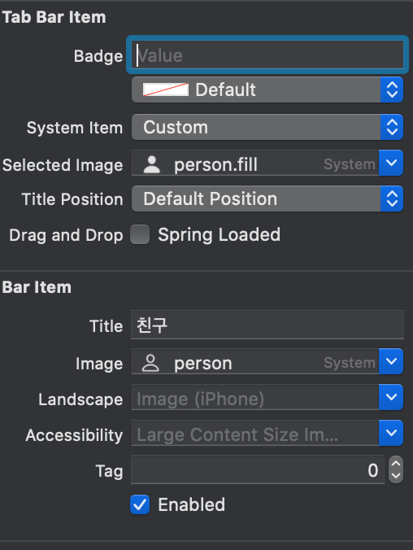
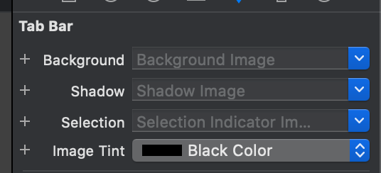

### 3주차 iOS 과제

✏️ 1. 도전과제! 탭바 컨트롤러에서 홈 또는 친구 탭 선택할 때마다 그림 바꾸기

✏️ 2. 도전과제! 테이블 뷰에서 스와이프 하여 목록 삭제하기

### 1번 도전과제 

맨 처음에는 저걸 어떻게 하지...? 하고 눈 앞이 캄캄했지만 의외로 쉽게 설정할 수 있었다.

​	

View Controller를 탭바 컨트롤러로 바꿔준 후 탭 하는 부분을 선택하면 위와 같은 설정 화면을 볼 수 있다. 

여기에서 

* 'Selected Image': 선택되었을 때 이미지
* 'Image' : 선택되지 않았을 때 평소의 이미지 

위으 두 항목에서 수정하면 구현할 수 있다. 그런데 이 때 Xcode에 내장되어 있는 기본 이미지를 선택하면 여전히 default 색인 푸른 색을 띄고 있는 것을 확인할 수 있는데 그럴 때는 

위 사진의 설정에서 'Image Tint' 의 색을 변경함으로써 푸른색을 바꿔줄 수 있다.