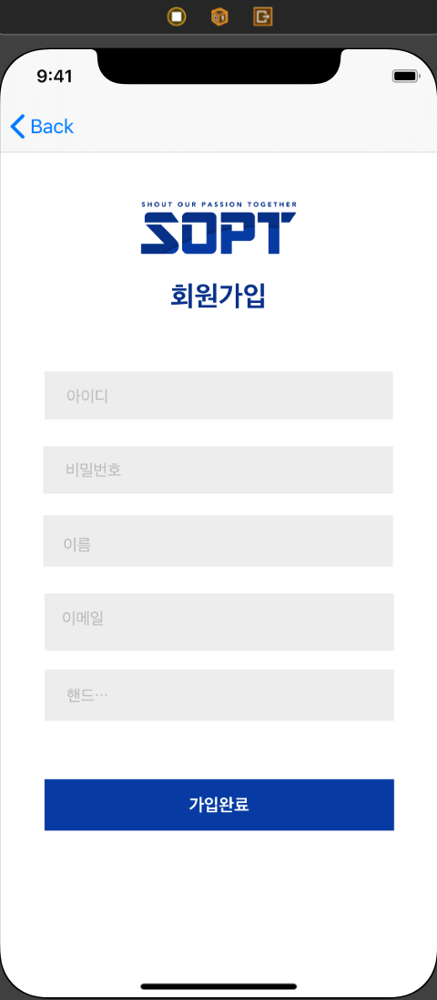
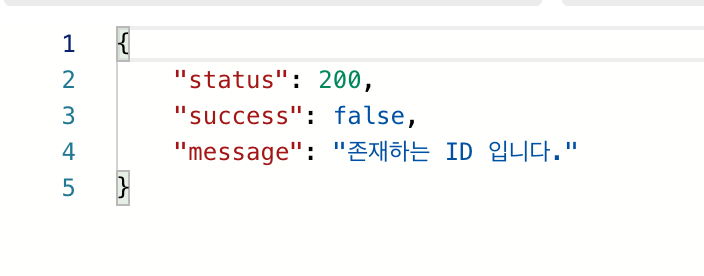

### 4주차 iOS 과제 

✏️ 회원가입 구현하기!!!

이번 주차의 과제는 로그인 기능 구현에 이은 회원가입 하기 였습니다. 그리고 추가 도전과제로  '회원가입 후 자동로그인 구현하기'가 주어졌습니다. 그러나 이번 주차는 아쉽게도 도전과제는 하지 못했... <del>이번 주에 할 일이 너무 많았...😫<del>  언제든 반든시 완성하여 깃푸쉬하기로 다짐합니다...👊


🧐스토리보드 구성 




🧐코드 구현


```Swift
import Foundation


struct SignupData: Codable {
    
    var status: Int
    var success: Bool
    var message: String
   
    
    enum CodingKeys: String, CodingKey {
        
        case status = "status"
        case success = "success"
        case message = "message"
       
        
    }
    
    init(from decoder: Decoder) throws {
        
        
        let values = try decoder.container(keyedBy: CodingKeys.self)
        status = (try? values.decode(Int.self, forKey: .status)) ?? -1
        success = (try? values.decode(Bool.self, forKey: .success)) ?? false
        message = (try? values.decode(String.self, forKey: .message)) ?? ""
    }
    
}
```

우선 이와 같이 SignupData.swift에 어떠한 status, success, message 등을 받을지를 작성합니다. 서버에 대해 정확히 알지는 못하지만 



포스트맨에서 API 테스트 시 받아오는 결과 부분.. 이 부분을 코드화 해주는 부분이 아닐까 생각해봅니다..ㅎㅎ.. 로그인과 달리 회원가입에는 토큰값이 필요하지 않으므로 로그인 시 선언해주던 **var** data: TokenData? 는 선언하지 않습니다.


다음으로 SignupService.swift 에서 최종적으로 데이터 통신에 성공한 경우, JSON타입 디코딩을 실행 한 후 값을 확인합니다.

```swift
private func isSignup(by data: Data) -> NetworkResult<Any> {
    let decoder = JSONDecoder()
    guard let decodedData = try? decoder.decode(SignupData.self, from: data) else { return .pathErr }
    
        if decodedData.success{
            return .success(data)
        }
        else {
            return .requestErr(decodedData.message)
        }
    }
    
}

```


그리고 마지막으로 회원가입 버튼을 눌렀을 때 회원가입에 성공하게 되면 다시 메인화면으로 돌아가는 부분까지 구현했습니다.

```swift
SignupService.shared.signup(id: inputID, pwd: inputPWD, name: inputNAME, email: inputEMAIL, phone: inputPHONE){ networkResult in switch networkResult {
               case .success:
               
                   
//메인화면이 가장 Root이므로 아래와 같이 구현하여 .success라면 메인 화면으로 이동
  self.navigationController?.popToRootViewController(animated: true)
                   
      
                   
                   
                   print("회원가입 성공")
            
            
               case .requestErr(let message):
                   guard let message = message as? String else { return }
                   
  //에러 발생시 지난 과제에 설정창을 공부하며 추가 공부했던 UIAlertAction 을 통해 회원가입 실패 안내 창을 띄워준다.
  let alertViewController = UIAlertController(title: "회원가입 실패", message: message, preferredStyle: .alert)
                   
                   let action = UIAlertAction(title: "확인", style: .cancel, handler: nil)
                   alertViewController.addAction(action)
                   
                   self.present(alertViewController, animated: true, completion: nil)
                   
               case .pathErr: print("path")
               case .serverErr: print("serverErr")
               case .networkFail: print("networkFail") }
               }
               
           }
        
```

