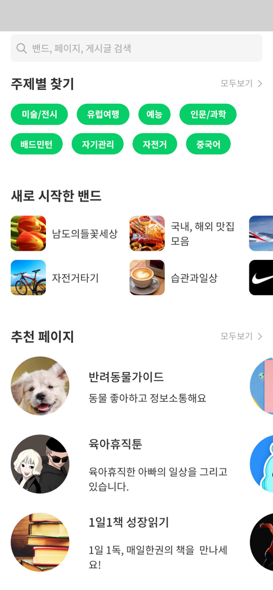
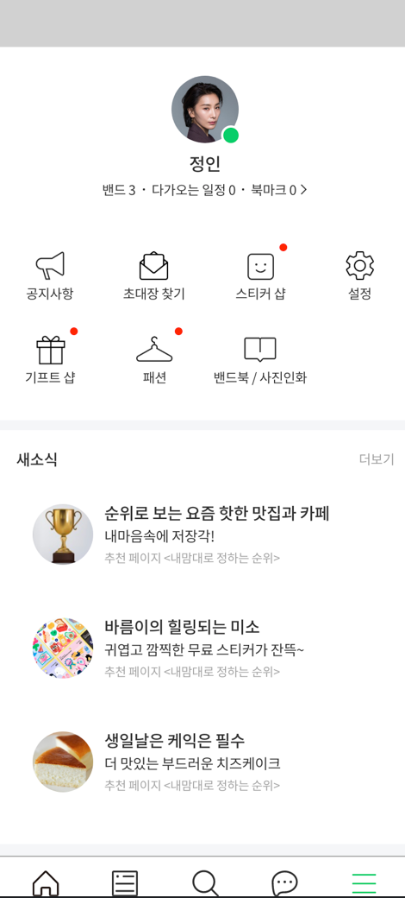
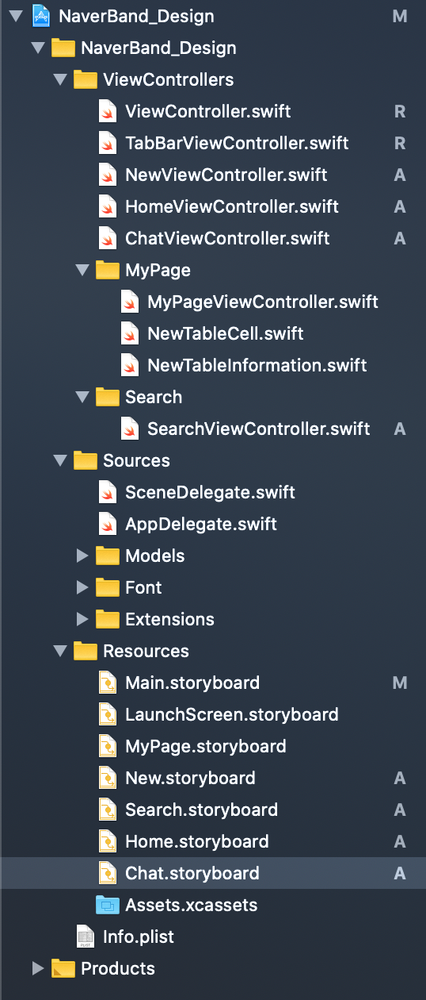
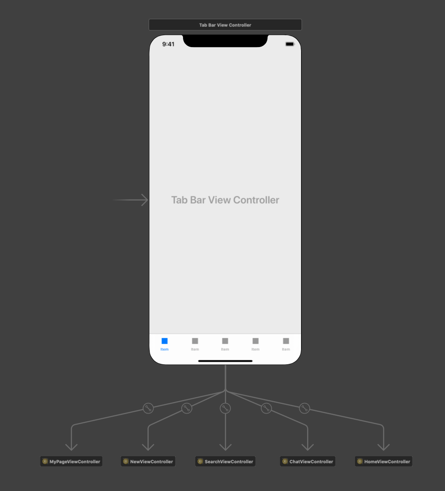
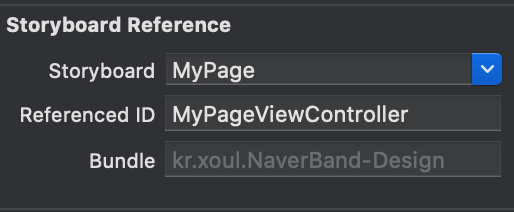
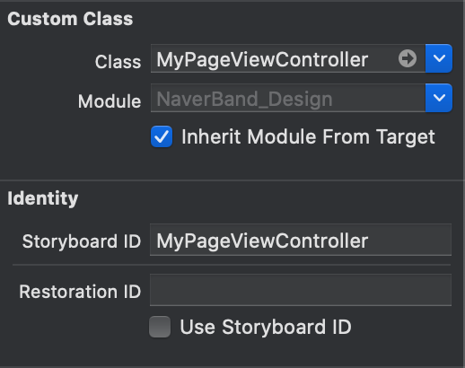

### 5주차 과제

📝디자인 & 아요 합동 세미나 뷰 구현하기

🧐구현해야 할 뷰:

1. 네이버 밴드 리디자인 검색 뷰

   

   

   

2. 네이버 밴드 리디자인 마이페이지 뷰 

   

***

### ✏️ 한 스토리 보드 말고 나눠서 구현하기

 지금까지는 계속 한 스토리보드 Main.storyboard 라고 되어 있는 곳에서만 작업을 했다. 그런데 물론 뷰가 많지 않을 때는 상관없지만 뷰가 많아지거나 하게 되면 한 스토리보드 파일에서만 작업하는 것이 힘들 것이라 생각하여 이번에는 스토리보드를 탭바의 버튼 별로 구분해서 개발을 진행했다.

이런 느낌으로 ...

이렇게 하려면  아래와 같이 Storyboard Reference를 이용해서 연결해주어야 한다.

이 때

1. Reference 를 클릭 후 연결할 Storyboard 이름과 뷰 컨트롤러 파일을 명시해 주자

   

2. 물론 해당 스토리보드에서도 뷰 컨트롤러 연결을 잘 해 주어야 한다

   

   

***

### ✏️마이페이지 뷰 구현하기

마이페이지 뷰는 위에는 뷰 위에 버튼을 올려놓는 형식으로 구현했고 아래의 새소식 부분은 테이블 뷰를 만들어서 구현했습니다.

